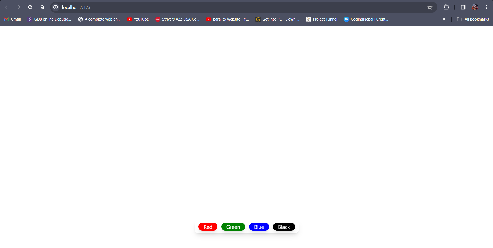
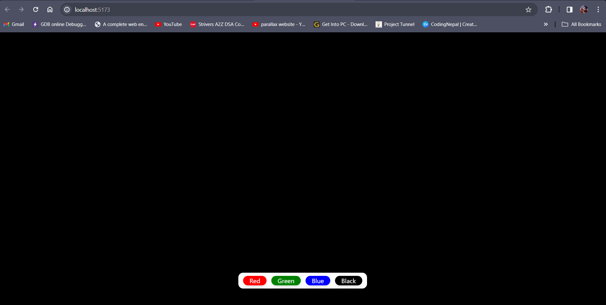

<h1>BGChanger</h1>

<h2>Description</h2>

BGChanger is a very basic React project that allows users to change the background color by clicking on color buttons provided on the screen.

<h2>Technologies Used</h2>
<ul>
    <li>HTML</li>
    <li>CSS</li>
    <li>JavaScript</li>
    <li>React.js</li>
</ul>

<h2>Installation and Running the Project</h2>
<ol>
    <li>Make sure you have Node.js installed on your machine.</li>
    <li>Clone this repository to your local machine using the following command:
        <pre><code>git clone &lt;repository-url&gt;</code></pre>
    </li>
    <li>Navigate to the project directory.</li>
    <li>Install dependencies using npm:
        <pre><code>npm install</code></pre>
    </li>
    <li>After the installation is complete, start the development server using the following command:
        <pre><code>npm start</code></pre>
    </li>
    <li>Open your web browser and navigate to <code>http://localhost:3000</code>.</li>
    <li>Click on the color buttons provided to change the background color.</li>
</ol>

<h2>Screenshot</h2>

 

<h2>Author</h2>

This project is created by Vishal Pandey.
